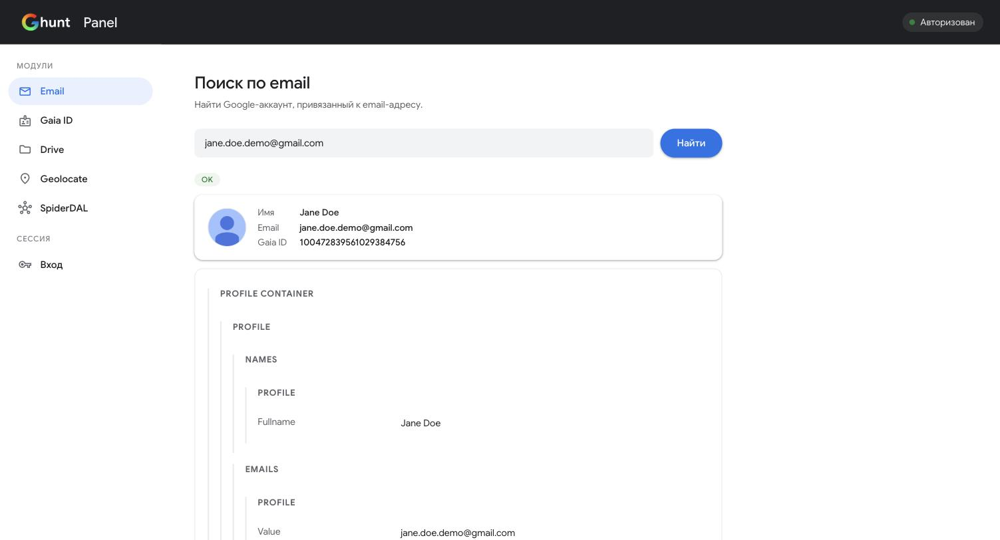

# ghunt-panel

A local, self-hosted web UI for [GHunt](https://github.com/mxrch/GHunt) — mxrch's OSINT
framework for investigating Google accounts. `ghunt-panel` wraps the `ghunt` CLI in a
small Flask app so you can run lookups, read the results, and manage your login session
from a browser tab instead of a terminal.

This project does not reimplement any of GHunt's investigation logic — it shells out to
the real `ghunt` binary and renders its `--json` output. All credit for the actual OSINT
work goes to [mxrch/GHunt](https://github.com/mxrch/GHunt).


> _Add a screenshot of the running panel here before publishing._

## Features

- Sidebar with all GHunt modules: **email**, **gaia id**, **drive**, **geolocate**, **spiderdal**
- Three ways to authenticate: GHunt Companion extension (base64), a manual `oauth_token`
  extracted from DevTools, or a raw master token — each with an in-app step-by-step guide
- Results render as readable cards (name, avatar, dates, links, booleans) instead of raw
  JSON by default, with the full JSON tree one click away (searchable, expandable, copyable)
- Live session status indicator (logged in / not logged in / `ghunt` not installed)
- One-click logout that wipes GHunt's local credentials file

## Installation

Requires Python 3.10+.

```bash
git clone <this-repo-url> ghunt-panel
cd ghunt-panel
pip install -e .
```

This installs both `ghunt-panel` and its dependency `ghunt` (the upstream CLI) into your
current environment. A plain `requirements.txt` is also provided if you'd rather manage
the install yourself:

```bash
pip install -r requirements.txt
```

Using a virtual environment is recommended either way:

```bash
python3 -m venv venv
source venv/bin/activate   # Windows: venv\Scripts\activate
pip install -e .
```

## Usage

```bash
ghunt-panel
```

This starts a Flask server bound to `127.0.0.1:5151` — open <http://127.0.0.1:5151> in
your browser. The port can be changed with the `PORT` environment variable:

```bash
PORT=8080 ghunt-panel
```

The panel is **local-only by design**: it binds to `127.0.0.1`, never `0.0.0.0`, and is
not meant to be exposed to a network or the internet.

### Logging in

GHunt needs a valid Google session to run lookups. The **auth** tab in the panel walks
through two options:

1. **GHunt Companion browser extension** ([Chrome](https://chrome.google.com/webstore/detail/ghunt-companion/dpdcofblfbmmnikcbmmiakkclocadjab) /
   [Firefox](https://addons.mozilla.org/en-US/firefox/addon/ghunt-companion/)) — install
   it, sign in to Google in that browser, click the extension icon, and paste the
   base64 string it gives you.
2. **Manual, no extension** — open Google's device-auth flow, sign in, then copy the
   `oauth_token` cookie value from your browser's DevTools (Application → Cookies).
   Both methods and every step are documented inline in the app.

You can also paste a raw master token directly if you already have one.

### Modules

Each tab maps to a GHunt CLI command:

| Tab | Command | Input |
|---|---|---|
| email | `ghunt email <address>` | Google account email |
| gaia id | `ghunt gaia <id>` | Gaia ID (numeric account identifier) |
| drive | `ghunt drive <file_id>` | Google Drive file/folder ID |
| geolocate | `ghunt geolocate -b <bssid>` | Wi-Fi access point BSSID/MAC |
| spiderdal | `ghunt spiderdal [-p pkg] [-f fingerprint] [-u url]` | Android package, cert fingerprint, and/or URL |

## Security & privacy

- Everything runs locally. The panel never sends your data anywhere except to Google's
  own APIs, and only via the `ghunt` CLI itself — the same requests the official CLI
  would make.
- The `oauth_token` / master token you paste into the **auth** tab is equivalent to your
  Google account password. It is used once to run `ghunt login` locally and is not
  logged, transmitted, or stored by this panel — GHunt itself persists it (encoded) at
  `~/.malfrats/ghunt/creds.m`, exactly as it does for CLI-only usage.
- Use this tool only against accounts and targets you're authorized to investigate
  (your own accounts, authorized pentests/CTFs, or otherwise consented OSINT work).

## License

Licensed under the [GNU Affero General Public License v3.0](LICENSE) or later, matching
the upstream [GHunt](https://github.com/mxrch/GHunt) project this tool depends on and wraps.

## Credits

- [mxrch](https://github.com/mxrch) — author of [GHunt](https://github.com/mxrch/GHunt),
  the OSINT engine this panel is a UI for.
